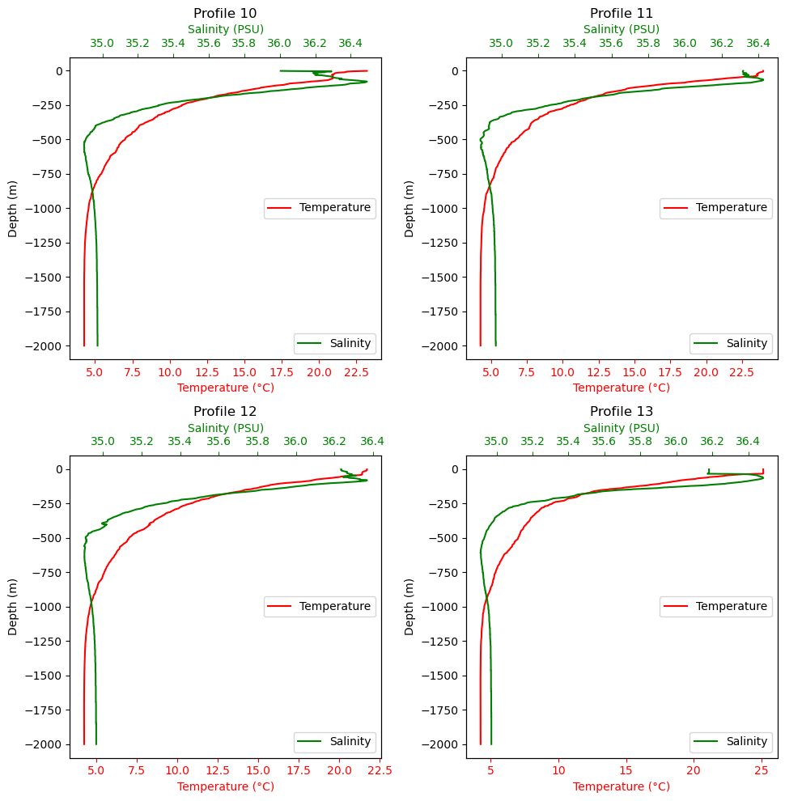
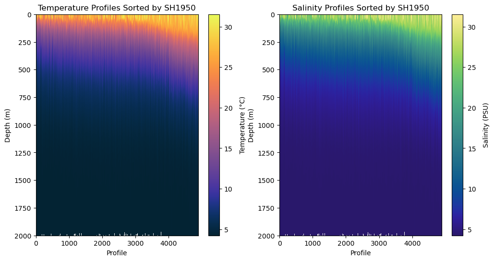

# Data

## ARGO_GoM_2022_0920

These are the fields contained in this file:

- ADT_loc (4890,)
- ADTnoseason_loc (4890,)
- LAT (4890,)  --> latitude
- LON (4890,)  --> longitude
- PRES (2001, 4890) --> pressure
- RHO (2001, 4890)  --> density
- SAL (2001, 4890)  --> salinity
- SH1950 (4890,)   --> sigma0
- SIG (2001, 4890)  --> sigma2
- SPICE (2001, 4890) --> spice (variations in the water mass)
- TEMP (2001, 4890) --> temperature (celcius)
- TIME (4890,)   --> time

<!-- Insert example image -->

<!-- Insert example image -->
